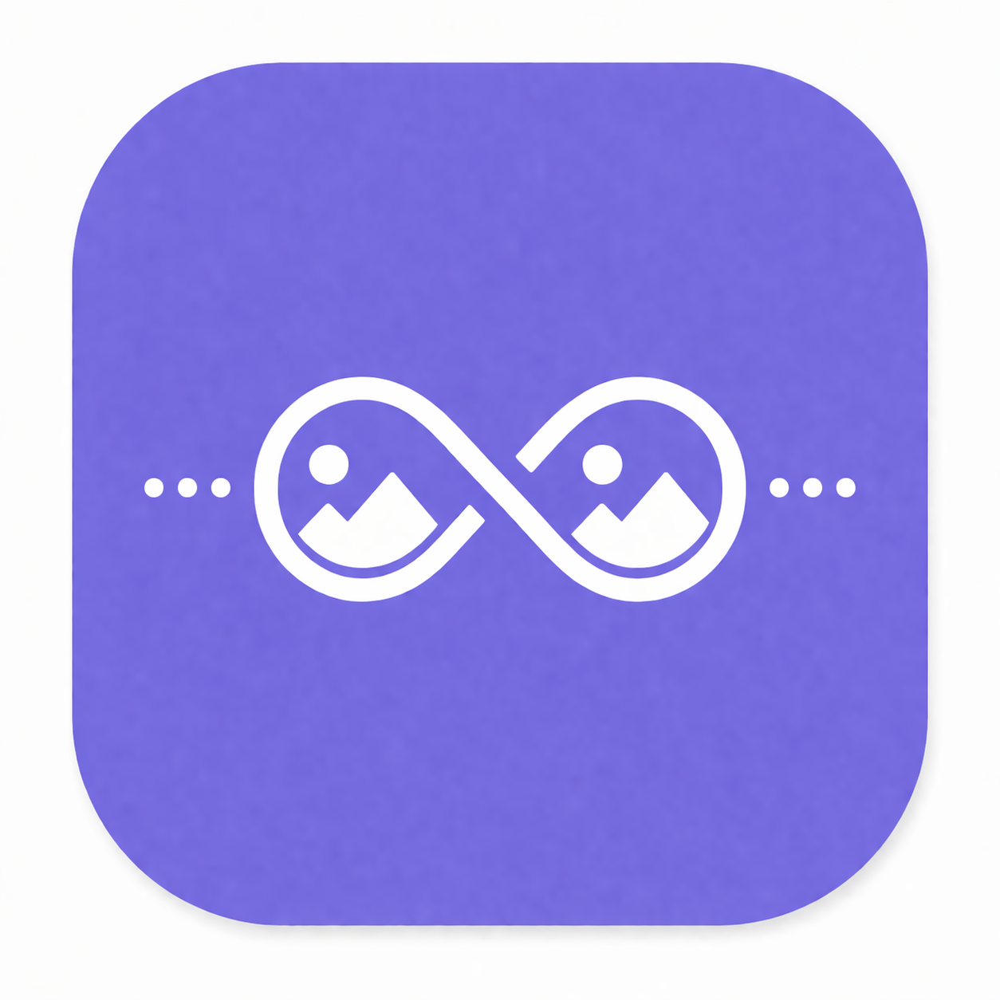

<div align="center">

</div>
 
# Infinite Images

> Browse a massive, ever-growing collection of high-quality photos powered by the **Unsplash API** — with seamless infinite scrolling, offline-first data delivery, and a smart freshness system.

<!-- SCREENSHOT PLACEHOLDER — replace with your actual demo GIF or banner -->
]()

---

## 📑 Table of Contents

- [About the Project](#about-the-project)
- [Key Features](#key-features)
- [What I Built & Learned](#what-i-built--learned)
- [Tech Stack](#tech-stack)
- [Architecture](#architecture)
- [Screenshots](#screenshots)
- [Getting Started](#getting-started)
- [Developer](#developer)

---

## About the Project

**Infinite Images** is an Android portfolio app that lets users browse thousands of photos from Unsplash with a smooth, paginated infinite scroll. The app is built around an **offline-first strategy** — data is fetched from the network, persisted locally, and served from the local database as the primary source of truth. A custom freshness mechanism and pull-to-refresh keep the content up to date without unnecessary network calls.

---

## Key Features

- ♾️ **Infinite scroll** — pages load automatically as the user scrolls
- 📶 **Offline-first** — image metadata is available without internet; only image rendering requires connectivity (per Unsplash policy)
- 🕐 **Smart data freshness** — auto-refreshes from page 1 only when data is older than 24 hours
- 🔄 **Pull-to-refresh** — bypasses the freshness check and forces a fresh load from page 1
- 🖼️ **Smooth image loading** — powered by Coil with built-in caching

---

## What I Built & Learned

### 🗄️ Offline-First with Paging 3 + Room + RemoteMediator
- Local Room database is the **single source of truth** for the UI
- `RemoteMediator` handles fetching new pages from the Unsplash API, saving them to Room, which then drives the UI automatically
- When the local data runs out, the mediator transparently loads the next remote page and persists it

### ⏱️ Custom Data Freshness Logic
- On app start, the app checks the **oldest entry** in the local database
- If older than **24 hours** → triggers a full refresh from page 1
- If within 24 hours → continues appending new pages without disrupting existing data

### 🔄 Pull to Refresh
- Overrides the freshness check entirely and forces reload from page 1
- Gives users manual control without waiting for the staleness threshold

### 🖼️ Image Loading Strategy (Coil + Unsplash Policy)
- Unsplash prohibits caching images locally for display
- **Image metadata** (title, author, dimensions, URLs) is cached in Room for offline access
- **Images themselves** are loaded via Coil; if the cache expires, a network connection is needed to reload

---

## Tech Stack

| Layer | Technology |
|---|---|
| Language | Kotlin 2.0.21 |
| UI | Jetpack Compose |
| Architecture | MVVM + Repository Pattern |
| Pagination | Paging 3 (with RemoteMediator) |
| Local DB | Room |
| Networking | Retrofit |
| Image Loading | Coil |
| API | Unsplash API |
| Min SDK | 26 |
| Target / Compile SDK | 36 |
| AGP | 8.10.1 |
| Gradle | 8.11.1 |
| Java | 21 |

---

## Architecture

```
UI Layer (Jetpack Compose)
        │
        ▼
ViewModel (StateFlow + Paging3 Flow)
        │
        ▼
Repository
   ├── Local Source  ◄──────────────── Primary source of truth (Room DB)
   └── Remote Source ─► RemoteMediator ─► Unsplash API ─► saves to Room
```

- **ViewModel** exposes a `PagingData` flow to the UI
- **Repository** coordinates local and remote sources
- **RemoteMediator** bridges Paging 3 with the remote API, triggering network calls only when local data is exhausted or stale

---

## Screenshots

> 📸 Screenshots coming soon

| Home Feed | Image Detail | Offline State |
|---|---|---|
|  |  |  |

---

## Getting Started

### Prerequisites
- Android Studio Meerkat or later
- Unsplash Developer API key → [Create one here](https://unsplash.com/developers)

### Setup

1. **Clone the repository**
   ```bash
   git clone https://github.com/rahulstech/infinite-images.git
   cd infinite-images
   ```

2. **Add your Unsplash API key**  
   In your `local.properties` file:
   ```
   UNSPLASH_ACCESS_KEY=your_access_key_here
   ```

3. **Build & Run**  
   Open in Android Studio and run on a device or emulator (API 26+)

> ⚠️ **Rate Limit Notice**  
> This app uses the **Unsplash Free tier** which allows **50 requests per hour**.  
> If pages stop loading mid-scroll, you have likely hit the rate limit — this is an API limitation, not a bug. Wait a while and scroll again to resume.

---

## Developer

**Rahul Bagchi**  
Android Developer

[](https://github.com/rahulstech)
[](https://www.linkedin.com/in/rahul-bagchi-176a63212/)
[](mailto:rahulstech18@gmail.com)
[](https://x.com/bagchirahul24)
[](https://discord.com/users/1338562691194683393)

---

> ⭐ If you found this project helpful or interesting, consider giving it a star!
